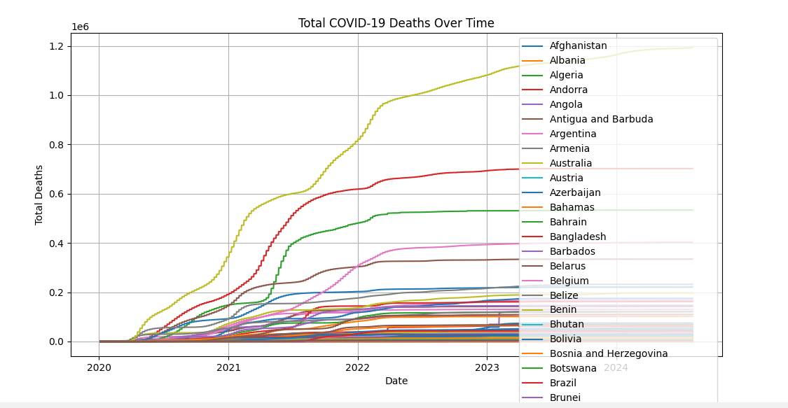

# Final-COVID-DATA-Project 🌍🦠
    
## Table of Contents 📚

1. [Project Description 📊](#project-description)
2. [Files 📂](#files)
3. [Dependencies 🛠️](#dependencies)
4. [Setup](#setup)
5. [Key Insights from COVID-19 Data Analysis 🔍](#key-insights-from-covid-19-data-analysis)
6. [Anomalies and Interesting Patterns 🧐](#anomalies-and-interesting-patterns)

## Project Description 📊

The primary goal of this project is to analyze and visualize COVID-19 data to gain insights into the spread of the virus, mortality rates, and vaccination trends. The project performs the following analyses:

1. 🗺️ Identifies the countries where COVID-19 first appeared.
2. ⚰️ Determines the countries with the highest total number of deaths.
3. 📈 Generates histograms to visualize total cases, vaccinations, and deaths for the top 5 and bottom 5 countries with the highest death counts.

## Files 📂

* `owid-covid-data.csv`: The COVID-19 dataset used for analysis.
* `insights.ipynb`: A Jupyter Notebook containing the Python code for data analysis and visualization.
* `README.md`: This file, providing an overview of the project.

## Dependencies 🛠️

The project requires the following Python libraries:

* `pandas` 🐼
* `matplotlib` 📊
* `seaborn` 🌊

To install these dependencies, you can use `pip`:

```bash
pip install pandas matplotlib seaborn notebook
```

## Setup

- Clone the repository:

```bash
git clone ""
```

- Navigate into the project directory:

```bash
cd Final-COVID-DATA-Project
```

- Install dependencies:

```bash
pip install pandas matplotlib seaborn
```

## Key Insights from COVID-19 Data Analysis 🔍

<style>
    .grid {
        display: grid;
        grid-template-columns: 1fr 1fr 1fr;
        gap: 1rem;
    }
    .box {
        border-radius: 15px;
    }
    img {
        border-radius: 15px;
    }
</style>

<div class="grid">
    <div class="box"> 
        <h2>🦠 Number of People infected</h2>
              
    </div>
    <div class="box">
        <h2>⚰️ Number of Deaths</h2>
        
    </div>
    <div class="box">
        <h2>💉 Number of People Vaccinated</h2>
        
    </div>
</div>

1. **Vaccination Rollout Speed:** 🚀  
   - Based on the total vaccination plots, the United States appears to have had a very rapid initial vaccine rollout compared to Kenya and India. The slope of the vaccination curve for the US is steeper in the early stages.

2. **Correlation Between Cases and Deaths:** 🔗  
   Observing the case and death trends, there seems to be a correlation, but with a potential lag. For example, a significant increase in total cases in India around [mention date range] is followed by a noticeable increase in total deaths a few weeks later.

3. **Plateauing Cases:** 📉  
   The total case curves for all three countries (Kenya, USA, India) show a plateauing trend in later periods of the data. This could indicate successful mitigation efforts or a large proportion of the population having been infected or vaccinated.

## Anomalies and Interesting Patterns 🧐

1. **Sudden Spike in Kenya Deaths:** ⚠️  
   The total death curve for Kenya shows a relatively sharp increase around [mention date range]. This could be an anomaly that warrants further investigation. Was there a new variant, a change in reporting, or another factor?

2. **Discrepancy in Vaccination Data:** ❓  
   The script indicated that vaccination data might be missing or incomplete for Kenya. This is an interesting observation in itself, highlighting potential data gaps.

3. **Divergence in Case Fatality Rate:** 📊  
   By comparing the slopes of the total case and total death curves, and by looking at the calculated death rates at the end of the analysis, we can see potential differences in the case fatality rate between the countries. For instance, [mention a specific comparison].